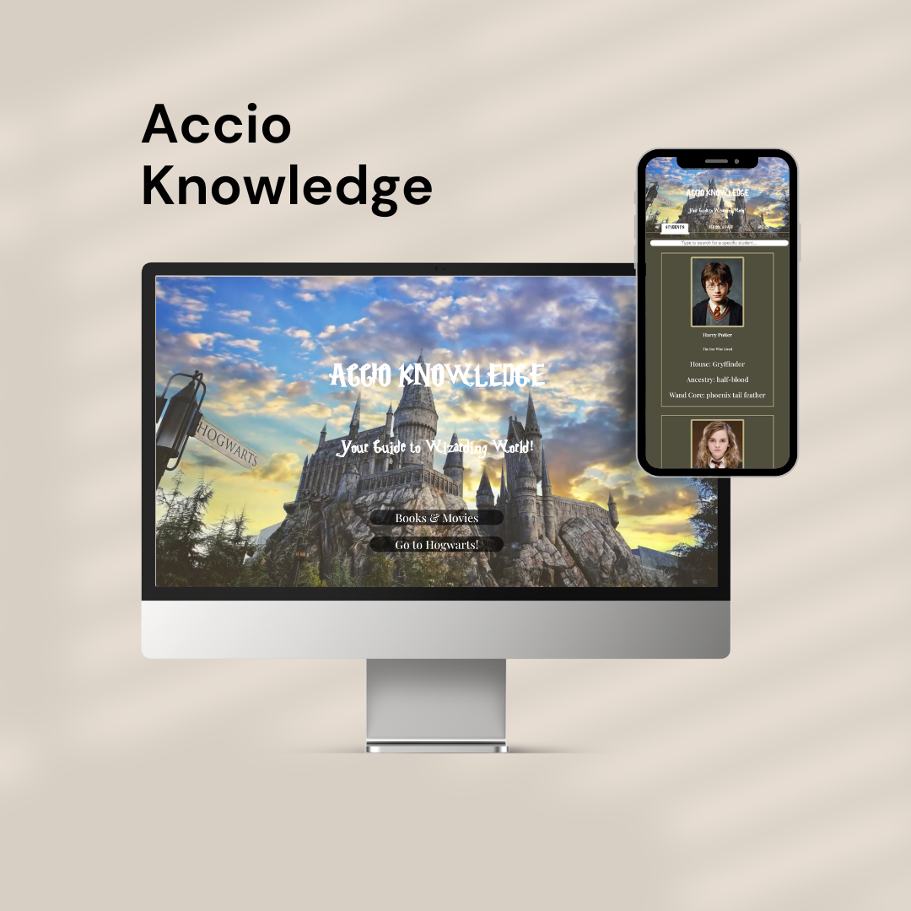
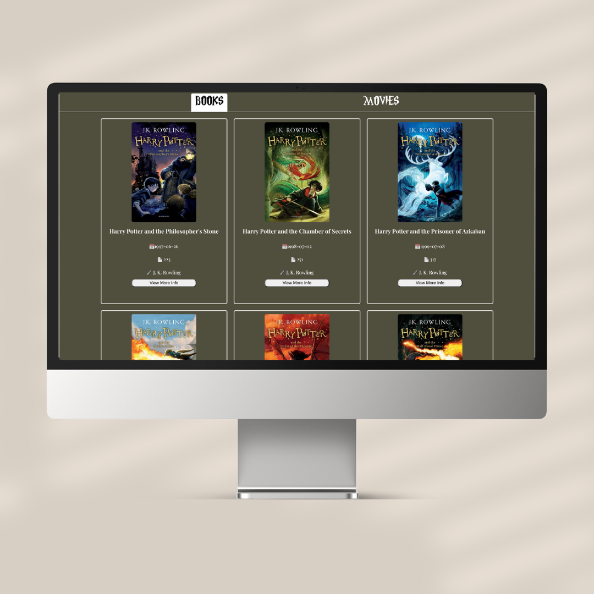
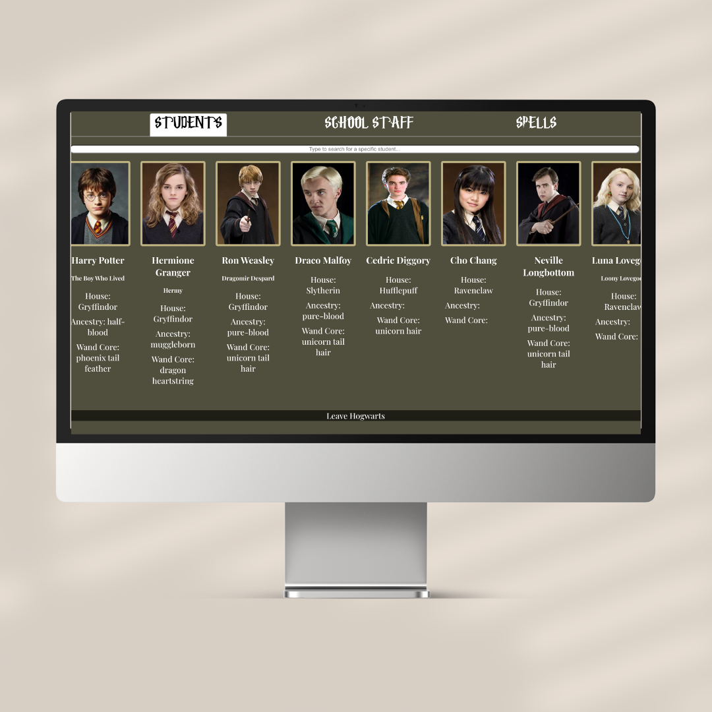

# Project Title

### Accio Knowledge

# Link:

# Table of Content:
<li>About the App</li>
<li>Screenshots</li>
<li>Wireframe</li>
<li>Technologies</li>
<li>Status</li>
<li>Credits</li>
 

# About the App:
Accio Knowledge is a website about Harry Potter. You can find all characters and spells in "Go to Hogwarts!" tab. In the "Books & Movies" tab you can explore every book and movie about Harry Potter.

You can specifically search your favorite student or staff in Hogwarts in "Go to Hogwarts!" tab.

Also it is possible to see details for each movie and book.

# Screenshots: 

# Wireframe:
[See in Figma](https://www.figma.com/file/m3aahBtsJyUfHJTnJC3BUY/Accio-Knowledge?type=design&node-id=0%3A1&mode=design&t=LE7XuQErrFHztT6w-1)

# Technologies: 
React

# Status:
Accio Knowledge is still in progress. Version 2 is on the way.

# Credits:

[HP-API!](https://hp-api.onrender.com/)  
[Potter DB](https://potterdb.com/)